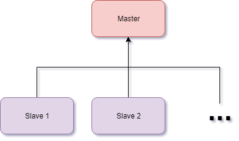

# What is Fireping?
> Ping withoud limits!
---

## What does it do?
Fireping is a program that let's you gather ping, trace route and HTTP data from servers and presents them in an easy to use environment on a graph.

## How does it work?
Fireping uses a **Master/Slave** architecture. This has two parts
- The Master which will host the dashboard that presents the data and lets you control/config all the Slave-nodes and much more.
- The Slaves which gather the data and send it to the master to present it on the dashboard.
You can setup multiple Slaves for a single Master but only one master per Slave.
{: .h-align-middle}